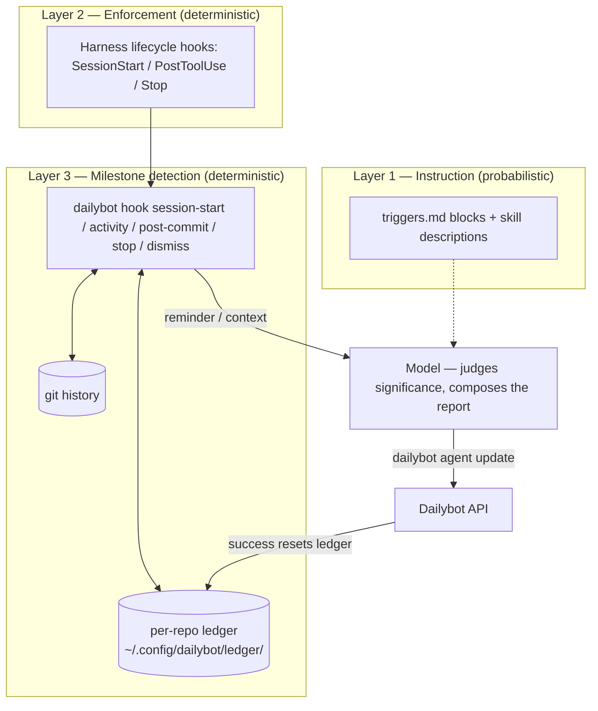
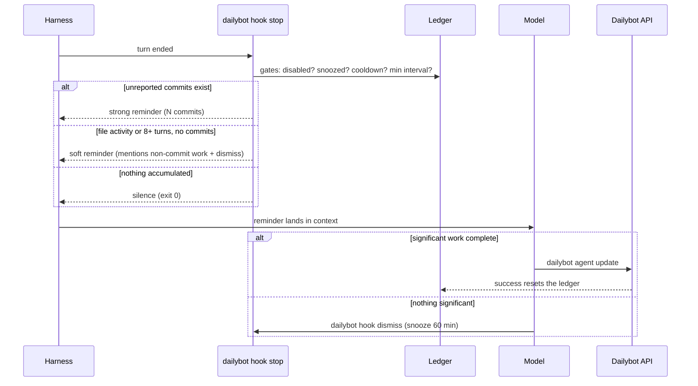

# Hooks Architecture — Autonomous Progress Reporting

> Contributor documentation (NOT installed). The runtime instructions agents
> actually follow live in
> [`skills/dailybot/report/hooks.md`](../skills/dailybot/report/hooks.md);
> the CLI-side reference is
> [DailybotHQ/cli — docs/AGENT_HOOKS.md](https://github.com/DailybotHQ/cli/blob/main/docs/AGENT_HOOKS.md).
> This file explains the design so future contributors can evolve it without
> breaking its guarantees.

## Why hooks exist

Before `dailybot-cli` 1.12.0, all proactivity in this skill was
**prompt-layer**: the auto-activation trigger blocks
([`triggers.md`](../skills/dailybot/report/triggers.md)) plus the skill
descriptions. Prompt instructions are probabilistic — long sessions bury
them under code context and the model forgets to report. Teams ended up
reminding developers, who reminded their agents.

Hooks add a **deterministic enforcement layer** underneath: the harness
itself runs a CLI command on lifecycle events, and that command decides from
local state whether the model needs a reminder. The model still judges
significance and writes the report — a shell script can't know *what* was
done, and doesn't need to.

## The three layers

| Concern | Owner |
|---------|-------|
| Detecting unreported work (commits, file activity, turns) | CLI ledger + harness hooks |
| Judging whether it's significant | Model (per [`significance.md`](../skills/dailybot/report/significance.md)) |
| Writing the Human-First report | Model (per [`writing-guide.md`](../skills/dailybot/report/writing-guide.md)) |

## End-of-turn decision flow

The **soft tier** is what covers the dominant modern case: work that never
produces a commit (research, analysis, generated documents). File-write
activity and the turn counter are deterministic proxies; the reminder text
explicitly tells the model to consider non-commit work.

## What this repo ships vs. what the CLI owns

| Piece | Lives in | Why |
|-------|----------|-----|
| Decision logic, ledger, anti-noise gates, output dialects | `DailybotHQ/cli` (`dailybot hook`) | Testable Python, versioned, identical across harnesses |
| Per-harness hook config templates + consent flow | This repo (`report/hooks.md`) | Install-time instructions are skill content |
| Reminder *response* behavior (report or dismiss) | This repo (router + `report/SKILL.md`) | It's model behavior, i.e. prompt content |

This split keeps every harness's hook entry a one-liner
(`dailybot hook stop --format claude`) — schema changes in a harness only
ever touch the thin template, never the logic.

## Invariants (do not regress)

1. **Consent before writing any config** — hooks follow the same opt-in
   rules as the trigger blocks (AGENTS.md rule 4). The uninstall marker for
   JSON configs is the `dailybot hook` command substring.
2. **Reminders instruct, never automate** — hook output asks the model to
   report or dismiss; nothing in this repo may auto-send a report without
   the model composing it.
3. **`.dailybot/disabled` silences hooks too** — the per-repo opt-out is
   honored inside the CLI, before any reminder is emitted.
4. **Graceful degradation below 1.12.0** — trigger blocks remain fully
   functional on their own; never make the skill hard-require the hook
   surface.
5. **Don't guess harness schemas** — `hooks.md` ships verified templates
   only for Claude Code and Cursor; other harnesses get command lines plus a
   pointer to their official docs, resolved at install time.
